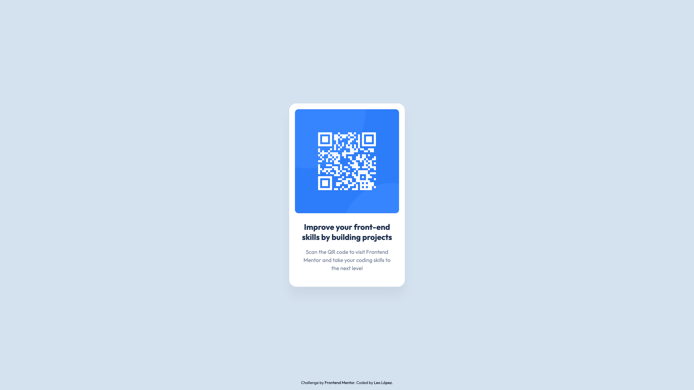

# QR Code Component With Astro - Frontend Mentor

This is a solution to [QR Code Component](https://www.frontendmentor.io/challenges/qr-code-component-iux_sIO_H) challenge of Frontend Mentor.

Frontend Mentor challenges help you improve your coding skills by building realistic projects.

## Table of contents

- [QR Code Component With Astro - Frontend Mentor](#qr-code-component-with-astro---frontend-mentor)
  - [Table of contents](#table-of-contents)
  - [Overview](#overview)
    - [Screenshot](#screenshot)
    - [Links](#links)
    - [Built with](#built-with)
  - [Author](#author)

## Overview

### Screenshot

### Links

- Solution URL: [https://www.frontendmentor.io/solutions/CHALLENGE_SOLUTION_URL_SLUG](https://www.frontendmentor.io/solutions/CHALLENGE_SOLUTION_URL_SLUG)
- Live Site URL: [https://ciensprog.github.io/FM-001-QR-Code-Component-With-Astro/](https://ciensprog.github.io/FM-001-QR-Code-Component-With-Astro/)

### Built with

- Semantic HTML5 markup
- [Astro](https://astro.build) - Astro is an all-in-one web framework for building fast, content-focused websites
- [Tailwindcss](https://tailwindcss.com) - Utility-first CSS Framework

## Author

- Frontend Mentor - [@Ciensprog](https://www.frontendmentor.io/profile/Ciensprog)
- Twitter - [@Ciensprog](https://www.twitter.com/Ciensprog)
